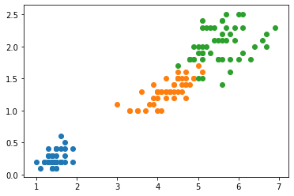
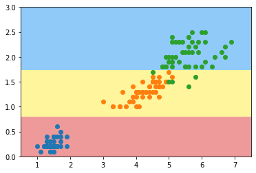
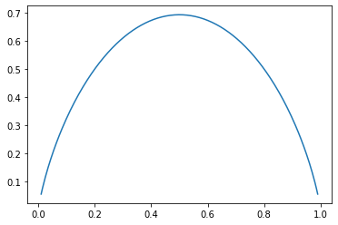

在看决策树之前，先看下之前说过的逻辑回归
【图】
上图为判断是否要交往的逻辑回归算法图

把身高，财富，颜值分别与w1,w2,w3想乘求和得到一个结果。

（其中w1为高的权重，如果比较在意身高，那么w1就会偏大一些，那么w1,w2,w3具体数值是怎么来的呢，就是从你上万次的相亲经验中总结出来的，例如，有很多次相亲对方有钱也很帅，但就是身高太低没同意，这时w1的值就会偏大）

得到结果后通过sigmond函数把值转化为0-1之间，这就得到了是否要交往的概率。


### 决策树

【图】

决策树就是 一个一个的去做条件判断


#### 代码实现


```python
import numpy as np
import matplotlib.pyplot as plt
from sklearn import datasets
```


```python
# 获取鸢尾花数据
iris = datasets.load_iris()
# 只使用最后两个特征（因为要在平台图上显示）
X = iris.data[:,2:]
y = iris.target

#显示数据
plt.scatter(X[y==0, 0], X[y==0, 1])
plt.scatter(X[y==1, 0], X[y==1, 1])
plt.scatter(X[y==2, 0], X[y==2, 1])
plt.show()
```





```python
# 创建决策树
from sklearn.tree import DecisionTreeClassifier
dt_clf = DecisionTreeClassifier(max_depth=2,criterion='entropy')
dt_clf.fit(X,y)
```


    DecisionTreeClassifier(class_weight=None, criterion='entropy', max_depth=2,
                           max_features=None, max_leaf_nodes=None,
                           min_impurity_decrease=0.0, min_impurity_split=None,
                           min_samples_leaf=1, min_samples_split=2,
                           min_weight_fraction_leaf=0.0, presort=False,
                           random_state=None, splitter='best')


```python
#显示决策边界函数
def plot_decision_boundary(model,axis):
    x0,x1 = np.meshgrid(
        np.linspace(axis[0],axis[1],int((axis[1]-axis[0])*100)),
        np.linspace(axis[2],axis[3],int((axis[3]-axis[2])*100))
    )
    X_new = np.c_[x0.ravel(),x1.ravel()]
    y_predict = model.predict(X_new)
    
    zz = y_predict.reshape(x0.shape)
    
    from matplotlib.colors import ListedColormap
    custom_cmap = ListedColormap(['#EF9A9A','#FFF59D','#90CAF9'])
    plt.contourf(x0,x1,zz,cmap=custom_cmap)
```


```python
plot_decision_boundary(dt_clf,axis=[0.5, 7.5, 0, 3])
plt.scatter(X[y==0,0],X[y==0,1])
plt.scatter(X[y==1,0],X[y==1,1])
plt.scatter(X[y==2,0],X[y==2,1])
plt.show()
```





由结果图可以看出 决策树如下

【图】

当x<2.4时，分为


非参数学习
可以解决多分类问题
也可以解决回归问题


#### 问题思考
- 每个节点在哪个纬度做划分？（相亲问题，为什么先判断身高？）
- 某个维度在哪个值上做划分？（相亲问题，为什么低于1米7就不交往？）

### 信息熵

熵在信息论中代表，随机变量不确定度的度量
- 熵越大，数据的不确定性越高
- 熵越小，数据的不确定性越低

公式：

H=

- 其中 k代表的是一共多少种类（比如鸢尾花中一个有3类）
- pi 代表每一类所占的比例 
- 负号是因为pi肯定为小数，log(pi)肯定小于0，所以要乘于-1

举例

比如3类鸢尾花中，每一类各占 1/3 即{1/3, 1/3,1/3}

则 H =-1/3log(1/3)-1/3log(1/3)-1/3log(1/3) = 1.0986

比如每一类各占 {10/10, 0/10,0/10}

则 H =-10/10log(10/10)-0/10log(0/10)-0/10log(0/10) = 0

所以，当各占1/3时，熵比较大，数据的不确定性较高

（就像箱子里有个数相同不同颜色的小球，每次抹到小球的颜色不确定性很高，如果都是白球，每次抹到小球的颜色就很确定）

#### 二分类公式 

如果一类的所点的比例为x,则另一类所占的比例就为（1-x）

H = 


#### 代码展示


```python
import numpy as np
import matplotlib.pyplot as plt
```


```python
# 二分类信息熵计算函数
def entropy(p):
    return -p*np.log(p)-(1-p)*np.log(1-p)
```


```python
x = np.linspace(0.01,0.99,200)
plt.plot(x, entropy(x))
plt.show()
```





由图可以看出，x=0.5时，信息熵取得最大值，此时数据不确定性最高


```python
def split(X, y, d, value):
    index_a = (X[:, d] <= value)
    index_a = (X[:, d] > value)
    return X[index_a], X[index_b], y[index_a]
```


```python
def try_split(X,y):
    # 存储最小的信息熵，默认为正无穷
    best_entropy = float('inf')
    # 存储最优的纬度（在哪一列进行划分），
    best_d = -1
    # 在最优的纬度上找出最优的划分值
    best_v = -1
    # 对所有的列进行循环
    for d in range(X.shape[1]):
        # 对d列的值进行排序
        sorted_index = np.argsort(X[:,d])
        # 对当前列的所有值进行循环
        for i in range(1, len(x)):
            v = (X[sorted_index[i-1], d]+X[sorted_index[i], d])/2
            
        
    
```


```python


```

    inf


```python

```
